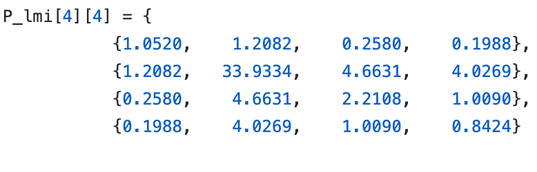
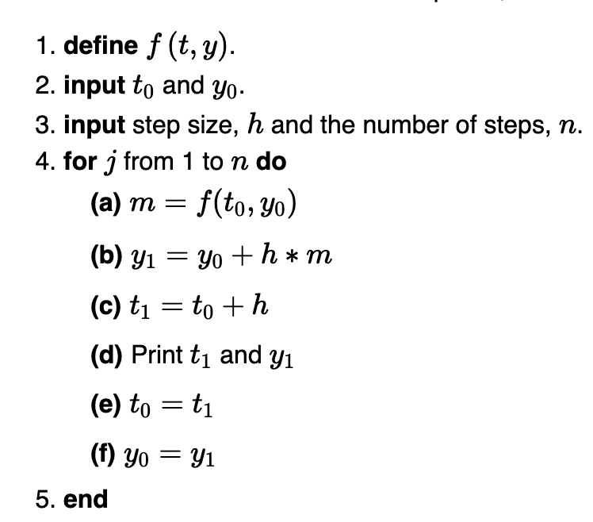
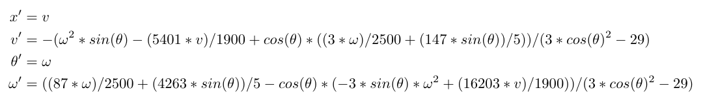

# On Rtreach

These are my notes as I seek to understand how this tool works. Mostly I'm just looking to understand how this works with respect to the pendulum. At the end of this, I hope this is a useful guide for anyone who wishes to use this tool for real-time reachability. 

# Brief description of the pendulum problem 

The control objective is to move the cart from one position to another along the track with the pendulum still standing at the upright position #920; =0. The DC motor has only limited power and the track length has finite length, thus there exists certain sates of the physical system from which the pendulum cannot be steered back to the upright position. 
## Definitions/Reference

- **REAL**: double
- **AVR-GCC**: AVR-GCC is a compiler that takes C language high level code and creates binary source code that can be uploaded into an AVR micro contoller. 
- In C if you want indicate that the compiler should treat a decimal as a single precision floating pointer number you use f.

### On x86 systems this is what gets executed when you run make 

```
gcc -std=gnu99 -O3 - Wall  main.c facelift.c geometry.c interval.c simulate.c util.c \ 
   dynamics_converging_oscillator.c dynamics_harmonic_oscillator.c dynamics_vanderpol.c \
   dyanmics_pendulum.c dynamics_pendulum_nonlinear.c pendulum.c -lm -o rtreach -DNONLINEAR_PENDULUM
```

## Entrypoint 

The main entrypoint for rtreach is [main.c](main.c). In this file we import the header file for the pendulum. 

It allows for MATLAB and if that variable is defined it imports the matrix.h header file. It also allows for ARDUINO (AVR platform). 

Definitions:
- defines state_n = 4 (not sure where this is used, but i'm gonna find out)
- runtimeMS 
- double startState[NUM_DIMS]

Methods
- main
   - reads arguments from the command line, 
      - The first parameter defines runtimeMs(which does?)
      - the rest if the para 
   - This function then uses the function defined in pendulum.c potential to get the LMI potential 
   - It also then runs the isSafe function defined in pendulum.c


## The core of RTREACH is contained in the following files

- [facelift.c](facelift.c)
- [geometry.c](geometry.c)
- [simulate.c](simulate.c)
- [util.c](util.c)

# The header files 

### geometry.h 

This file picks the dynamics header to comiple. 
- If you use the -DLINEAR_PENDULUM flag it selects [dynamics_pendulum.h](dynamics_pendulum.h) file. 
- -DNONLINEAR_PENDULUM gets you [dynamics_pendulum_nonlinear.h](dynamics_pendulum_nonlinear.h). 

Let's consider the non-linear case. 

The [dynamics_pendulum_nonlinear.h](dynamics_pendulum_nonlinear.h) file specifies the number of dimensions. In the case of the inverted pendulum which is an example considered in this repository there are 4 states, therefore 4 dimensions. The real time reachability algorithm uses boxes to represent the states. The technique makes use of mixed face-lifiting and in mixed face lifting the dynamics along each face are over-approximated by the maximum derivative along that face. For a box, there are two faces for every dimension (one for the minimum
face along that dimension and one for the maximum face).


Thus, NUM_FACES = (2* NUM_DIMS)

Definitions in this file:

- **Interval**: C struct with two fields {double min, double max} . 
- **Hyperpoint**: C struct that is a double array of size NUM_DIMS (In the case of the inverted pendulum this a double array of size 4).
- **HyperRectangle**: C struct that is an array of intervals of size NUM_DIMS (For the inverted pendulum it has a shape of (4,2)).

Methods declared in this header file and their explanations (**add them as you figure it out** ): 

- double interval_width(Interval* i);
   - **explanation**:
- bool hyperrectangle_contains(HyperRectangle* outside, HyperRectangle* inside, bool printErrors);
   - **explanation**:
- void hyperrectangle_grow_to_convex_hull(HyperRectangle* grower, HyperRectangle* contained);
   - **explanation**:
- double hyperrectange_max_width(HyperRectangle* rect);
   - **explanation**:
- void hyperrectangle_bloat(HyperRectangle* out, double from[NUM_DIMS], dobule width);
   - **explanation**:

### dynamics_pendulum_nonlinear.h

This file simply defines DYNAMICS_PENDULUM_NONLINEAR and NUM_DIMS.

The DYNAMICS_PENDULUM_NONLINEAR specifies which dynamics file to use. So 
- DYNAMICS_PENDULUM_NONLINEAR corresponds to [dynamics_pendulum_nonlinear.c](dynamics_pendulum_nonlinear.c)
- DYNAMICS_PENDULUM corresponds to [dynamics_pendulum.c](dynamics_pendulum.c)

### dynamics.h

This header file defines one function: 
- double get_derivative_bounds(HyperRectangle* rect, int faceIndex)

### face_lift.h

This file is the header file for the main mixed face-lifting algorithm. 

It defines a struct called LiftingSettings with the following fields:
- init which is a hyper-rectangle
- reachtime which is a double denoting the total reach time
- initialstep size which is the size of the steps to use
- maxRectWidthBeforeError
- maxRuntimeMilliseconds 

The struct also defines pointers to functions:

- bool (*reachedAtIntermediateTime)(HyperRectangle* r);
      - **explanation**:
- bool (*reachedAtFinalTime)(HyperRectangle* r);
      - **explanation**:
- void (*restartedComputation)();
      - **explanation**:

Pointers to functions:
- The idea behind pointers to functions is that it's possible to write a function that takes the address of another function as an argument. This enables the first function to find the second function and run it. Thus enabling the possibility of passing different function addresses to the first function at different times for different purposes.

The function also defines one method that uses the struct defined above:
- bool face_lifting_iterative_improvement(int startMs, LiftingSettings* settings);
   - This function does face lifting with the settings given above. It does not do iterative improvment. It tries to do everything in a single step (which is best for short reach times). It will return true if the set of states is satisfcatory according to the function you provide in LiftingSettings (**HUH?**)


### pendulum.h

This file has declarations for three methods:
- double potential(double pos, double vel, double theta, double omega);
   - **Explanation**: The inputs to this function are the states of the pendulum and it returns the value of the Lyapunov potential function. This potential function approximates a region known as the recoverable region. The recoverable region is a region of the state space in which a given controller can stabilize the system. from the gain controller computed offline by solving the LMI problem. The solution of this problem yields a gain vector K and a matrix P such that . As per the following [report](https://apps.dtic.mil/dtic/tr/fulltext/u2/a373286.pdf), this gain value can be use to stabilize the system asymptotically and  can be used to approximate the ellipsoid of the recoverable region. Thus this function computes the value of this potential function with P defined below: 

- int isSafe(int runtimeMs, double state[NUM_DIMS])
   - **Explanation**: The first thing this function does is compute the lyapunov potential as defined above. If the potential is less than equal to 1, Then we return 1.
- bool runReachability(double * start, double simTime, double wallTimeMs, double startMs); 
   - **explanation**


### util.h

Defines two global variables:
- bool intitialized: (which does?)
- long int startSec

Methods: 
- void error_exit(const char* str); 
   - **explanation**
- void set_error_print_params(LiftingSettings* set);
   - **explanation**
- long int milliseconds();
   - **explanation**


### simulate.h

This file define one method called simulate 
- void simulate(REAL point[NUM_DIMS], double stepSize, bool (*shouldStop)(REAL state[NUM_DIMS], double simTime, void* p), void* param);
   - **Explanation**: The header of this function says that it peforms simulation using Euler's method for numerical simulation. For those of us, who don't remember what this means look at the following [article](https://tutorial.math.lamar.edu/classes/de/eulersmethod.aspx). Euler's method is a numerical analysis technique that allows one to approximate solutions to differential equations. It takes the point from which to conduct the simulation and the derivative evaluated at this point to write down the equation of the tangent line. It then uses this to approximate the solution at a given step from the initial point. This process can be repeated to perform a simulation. Pseudocode below: 

- shouldStop(double state[NUM_DIMS], double simTime, void*p)
   - **Explanation**: This function is utilized in simulate. computes the lyapunov function for a given state. So far I think p the last pointer is the stop time and then it gets set to simTime (huh?). If rv <1. In simulate.c its says *p is param. 

- simulate(double startPoint[NUM_DIMS],double stepSize, bool (*shouldStop)(REAL state[NUM_DIMS], REAL simTime, void* p), void* param)
   - **Explanation**: the simulation uses a hyper-rectangle but with the min and max at the same point so its not really an interval but rather a point. 


# Dynamics Files 

### dynamics_pendulum_nonlinear.c



